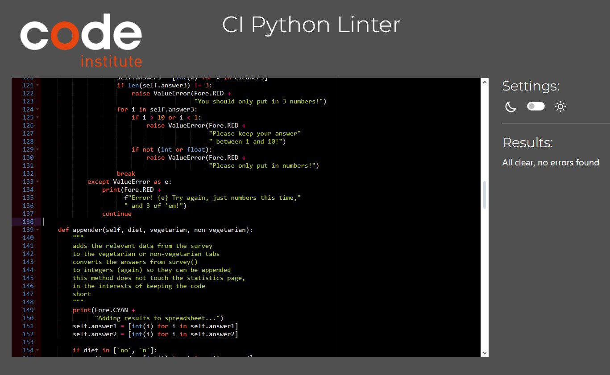

# **Stock Trading Journal**

Live Website: [Food Survey](https://elliott-food-survey-c4688ed90296.herokuapp.com)

The Food Survey acts as an automated survey run through a Python terminal. Its goal is to collect data from both vegetarians and non-vegetarians in terms of their food preferences, allowing restaurants, grocers, food vendors, and anyone who hosts guests to make solid guesses in terms of what they should buy. 

Data from vegetarians is separated for three reasons:

1) To determine if a vegetarian diet has any substantial impact of preferred meats and vegetables.

2) To prevent asking meat-related questions to people who do not eat meat, as this would incorrectly skew the data.

3) To see if people who eat meat prefer it to other types of food, eg, if there exists a preference for pork over, for example, potatoes.

***

## **Project Goals**

The most important goal of the project is to make an easy survey, which can be sent to friends and family, as well as prospective customers. Because of this, the most important part of the project is the survey its self, followed by the average responses, and finally the favorite overall food. 

By running the survey through a terminal, rather than as a website, survey-takers have little choice than to focus on the content of the application its self -- since there are no ads, flashy elements, etc.

***

## **User Goals**

### **First Time Users Goals**

+ As a parent of popular children, I want to know what foods are popular right now before anyone else's kids come to my house.
+ As someone who rarely hosts guests at my house, I only know my food preferences; I'd like to make an educated guess about others, rather than just make guesses.
+ I'm curious if my food preferences are very unique or not.

### **Frequent User Goals**

+ I own a small grocery store, I want to stay on top of any shifting trends.
+ I run a cooking channel, so if people start getting really into potatoes, I want to be ready to shift my videos accordingly.
+ I'm someone obsessed with data, and I want to see if the general public's food preferences change or stay the same.

### **All User goals**

+ I want solid data on the different popularities of food.
+ I want to know what kinds of food will make me popular.
+ I don't want to deal with a cluttered website -- I just want the numbers!

### **Fulfillment**

Because the application is terminal-based, the appearance stays minimalistic, ensuring a low chance of getting distracted with unnecessary clutter.
> I don't want to deal with a cluttered website -- I just want the numbers!

After inputting your own preferences, the average scores for non-vegetarians or vegetarians, depending on your preferences, will print out, along with the most popular food at the moment.
> As a parent of popular children, I want to know what foods are popular right now before anyone else's kids come to my house.

>As someone who rarely hosts guests at my house, I only know my food preferences; I'd like to make an educated guess about others, rather than just make guesses.

>I own a small grocery store, I want to stay on top of any shifting trends.

>I'm someone obsessed with data, and I want to see if the general public's food preferences change or stay the same.

>I want solid data on the different popularities of food.

The survey will tell you the current most popular food (out of the six or nine, depending on user's diet choice).
>I'm curious if my food preferences are very unique or not.

>I want to know what kinds of food will make me popular.

>I run a cooking channel, so if people start getting really into potatoes, I want to be ready to shift my videos accordingly.

***

## **Structure**

### **Navigation**

+ After opening the survey, users will be asked their name -- for users with no terminal experience, this will open the door to typing in answers.
+ After being asked for their name, users are then asked if they're vegetarians or not.
+ The app will walk you through two or three separate questions.
+ Each question corresponds to a category (everyone is asked about fruits and vegetables, and non-vegetarians are asked another question about meat).
+ Users will not need to do anything for their data to be put into the correct column, other than the initial diet question.

**Starting Screen**  

**Input Stock Trading Data**  

**Display Journal Entries**  

**Display Trading Statistics**  

### **Trading Journal Input**

+ Inputs can only be made with the keyboard.
+ Input is validated wherever an input can be made, so that it fits the google sheet.
+ Input validation testing can be seen in the testing section.

**Input for diet**
+ Much of the program depends on a "yes" or "no" answer to the diet question. A "y" or "n" response will also be accepted.

+ When a choice is made, both the content of the survey and where the diet is stored are decided.

+ If a user puts in anything other than "yes"/"y" or "no"/"n", they are prompted to try the question again. This ensures the program not only runs correctly, but that the data is correctly sorted.

**Input for Rating Foods**
+ After the diet field has been satisfied, users are prompted to rate three foods from a value of 1-10.

+ If the user puts in anything other than a number between 1-10, the question is repeated.

**All user inputs are valid**
+ If the survey's questions are answered correctly, the data is pushed to either the "Standard" or "Vegetarian" tabs in Google Sheets.

+ The number of responses is also increases by one -- this is done after validation to ensure incomplete responses aren't counted.

**Data is incorrect**
+ If the diet receives an incorrect value, eg, anything other than "y"/"yes" or "n"/"no", they are made to input another response.

+ If the user inputs a number not between 1-10, a number with a decimal space, or a letter, they are asked the question again.

## **Features**

### **Existing Features**

**Program**
+ Terminal based for quick responsiveness
+ Google sheet to contain survey data
+ The simple instructions and automation ensures the program is applicable for all ages, requiring minimal tech literacy

**Inputs**
+ This program uses keyboard inputs for quick navigation
+ Data input to fill out a google sheet
+ Input validation for input fields to minimize incorrect data entries or breaking the program

**Current averages for a given diet**
+ After the survey is completed, users will be given a dictionary with the averages for their diet-group
+ This uses the number of responses to divide each element in the relevant sheet, added together

**Most Popular**
+ The averages list of the user's diet-group is then analyzed
+ The cell with the highest average is, therefor, the most popular
+ This information is then relayed to users at the end of the survey.

**Color Coding**
+ Error messages are red
+ Each survey question is color-coded, so users don't get confused
+ When the survey is simply talking, the printed statement is blue
+ When the survey is working, or giving data, the printed statement is cyan
+ Finally, the rating instruction to separate values by commas is bright white, in contrast to the instruction to rate between 1-10

### **Features left to implement**

+ Ability to view the data for the not-selected food-group
> Since the application is intended for personal use first, and commercial use second, this feature was not implented due to time-constraints
> For now, users who are curious about the other end can have a friend whose preferences correspond answer the survey, or take it again themselves. 

+ A final question before the data is sent to Google sheets
> The questions are very simple, and not exactly life-or-death, so for now this feature is absent.

+ Do the survey again without pressing "run program"
> Since this is a survey, it's suboptimal to encourage users to put in answers to it more than once.

***

## **Technologies**

### **Language**

+ [Python](https://www.python.org/)
    - Main programming language used in this project

### **Libraries**

+ [Colorama](https://pypi.org/project/colorama/)
    - Used to color terminal text
+ [GSpread](https://docs.gspread.org/en/v5.10.0/)
    - Python API for google sheets

### **Tools**

+ [PIP](https://pypi.org/project/pip/)
    - Package installer for Python
+ [Git](https://git-scm.com/)
    - Version control system
+ [GitHub](https://github.com/)
    - Used to store and manage code
+ [Heroku](https://dashboard.heroku.com/)
    - Used to deploy the project
+ [Gitpod](https://gitpod.io)
    - Preferred IDE, used to actually write the code
+ [Lucid Charts](https://www.lucidchart.com/pages/)
    - Data and chart visualization
+ [CI Python Linter](https://pep8ci.herokuapp.com)
    - Code quality advisor software for error and mistakes detection

***

## **Testing**

+ Each input option was tested to ensure only the intended options are put in
+ Every thinkable error was tested for given exceptions
+ For reference, the valid input is "yes" or "no" (or "y" or "n") for the diet question
+ Valid input for the rating questions are only whole numbers between 1 and 10, separated by commas
+ Since the internet connects the entire world, it's better safe than sorry. Therefor, the name input is not restricted.

### **Input Validation**

In this program are various methods for inputting data:

+ Using the keyboard to rate food groups
+ Using the keyboard to type "yes" or "no" to the diet question

Each input field within the program is safeguarded against errors through one of the following mechanisms:

+ **Restricting input to the diet question to only "yes"/"y" or "no"/"n".**

+ **Validate Ratings**  
    - Every rating must be 3 whole numbers, between 1-10, and separated by commas.

+ **Validate Numbers with Decimals**  
    - As depicted in the image below, only numerical inputs with no decimals are accepted.

### **Input Validation Testing**
Validation is obviously crucial for any programming project, and in this case, almost everything hinges on a correct input to the diet question -- otherwise, the intended sorting will not happen, and users may not be asked the meat question at all.

Testing has been conducted the following way:
1. Running the program
2. Following the instructions to enter various inputs
3. At every step the following inputs have been tested

| Input              |       |        | Value    |              |              |   |   |   |
| ------------------ | ----- | ------ | -------- | ------------ | ------------ | - | - | - |
| Numbers to Ratings | 1,2,3 | 1,11,3 | 10,5,5.5 | 10.3333,5,10 | 10,10,11.555 | 10,10,10,10  |   |   |
| Numbers to Diet    | 1     | 2      | 0        |              |              |   |   |   |
| Words to Diet      | Yes   | yes    | No       | no           | Y            | y | N | n |
| Words to ratings   | Yes   | no     | No       | no           | Y            | y | N | n |
|                    |       |        |          |              |              |   |   |   |

As evident from the testing table below, various inputs have undergone thorough examination and validation.

Correct Input - Input is validated and confirmed with a green message. The program proceeds to the next stage.

Incorrect Input = The input is declined and a decline message in red is displayed. The program reacts and repeats the last input sequence until valid input is provided.

**Testing Results**
| Test                                              | Expected  | Result    | Intended Use |
| ------------------------------------------------- | --------- | --------- | ------------ |
| Acceptable Numbers in Rating                      | Pass      | Pass      | Yes          |
| Unacceptable Numbers in Rating                    | Exception | Exception | Yes          |
| Letters in Rating                                 | Exception | Exception | Yes          |
| Numbers in Diet                                   | Exception | Exception | Yes          |
| Value Other Than "yes", "y", "no", or "n" in Diet | Exception | Exception | Yes          |
| Acceptable Values in Diet                         | Pass      | Pass      | Yes          |
| No Commas Separating Values in Rating             | Exception | Exception | Yes          |
| More Than 3 Values in Rating                      | Exception | Exception | Yes          ||

### **Other Tests**

All Python files have been inspected using a pep8 linter, and no errors have been detected.

[Code Institute PEP8 Linter](https://pep8ci.herokuapp.com)

### **Unresolved Errors, Issues and Bugs**

To date, there are no known bugs or issues with this application.

***

## **Deployment**

### **Project Creation**

The project was started by navigating to the [template provided](https://github.com/Code-Institute-Org/p3-template) and clicking 'Use this template'. Under Repository name I input food-survey and checked the 'Include all branches' checkbox. 

I found the program on my Github account by going to [Gitpod](https://gitpod.io), selecting "New Workspace", selecting my Github account, and searching for "Food Survey".

+ git add . - This command was used to add all changes made to the file

+ git commit -m *commit message explaining the updates* - This command was used to commit changes to the local repository.

+ git push - This command is used to push all committed changes to the GitHub repository.

### **Run Locally**

1. Get the repository URL
2. Go to Gitpod.io
3. Select New Project
4. Paste the repository URL
5. Select VSCode 1.90.1
6. Select preferred storage class
7. Hit "continue"
8. Type "python3 run.py"

To stop the script file:
+ "Ctrl + C" - To stop the current file from running

### **Deployment to Live Service**

My Food Survey project was deployed using the Gitpod IDE, using Git and GitHub for version control. It is hosted on Heroku.

1. Get Python file ready for deployment

> Ensure the Python project is ready for deployment and includes all necessary dependencies in a requirements.txt file using this command.

> pip3 freeze > requirements.txt

2. Pushing GitHub

> Make a commit and push the current version of the program to GitHub.

> git commit -m "..."  
> git push

3. Heroku starting a new project

> Visit the [Heroku](https://dashboard.heroku.com/) dashboard and click "New App" after that, give the project a name and select a region, next.

4. Heroku project settings

> In the project dashboard click "Settings" and head to the "Project Vars" section. CLick "Reveal Config Vars" opening two input fields. In the first field "KEYS" insert the word "CREDS". The second field "VALUE" copy and paste the contents of the CREDS.json file. This file is not open to the public and must be kept secret.

5. Heroku Buildpacks

> Head to "Buildpacks" section and click "Add Buildpack". In the newly opened window, select "Python" then "Add Buildpack". Repeat this step and add "Nodejs" next.

6. Connecting to GitHub

> Click the "Deploy" tab and select "GitHub" and then "Connect to Github".

7. Selecting the Project

> After successfully connecting to GitHub a search bar opens. Type the name of the repository your project is in. A dropdown menu will open, click on the correct repository. This links up the repository from GitHub to heroku.

8. Deployment

> Scroll down and select either "Automatic deploys" or "Manual deploy". After the deployment is finish, head over to the "Overview" tab on heroku. On the top right, click "Open app" a new tab will open with the deployed project.

***

## **Credits**

### **Project Idea**

The inspiration for this project originated from my personal experience as a "hobby day trader." The repetitive task of manually filling out Excel sheets after each trade became cumbersome and frustrating. Many online trading journals also came with monthly subscription fees ranging from $20 to $50. In the future, I plan to expand this project by developing an automated trading journal connected to brokerage APIs. However, for the time being, this manual input stock trading journal serves as a cost-effective and efficient solution.

### **Content**

The content of this tool was created by me, aka. [Acelliott1218](https://github.com/acelliott1218).

The Python code provided was made with the knowledge gained through the CodeInstitute Full Stack Developer course.

Google was used to find answers to questions which were not covered in the CodeInstitute Course. These are credit in the comments of the document its self.

### **Acknowledgements**

I'd like to thank my mentor [Daisy McGirr](https://github.com/Dee-McG) for her guidance throughout my project.

And [NixTS](https://github.com/NixTS) for the README for which this README's content is based on.